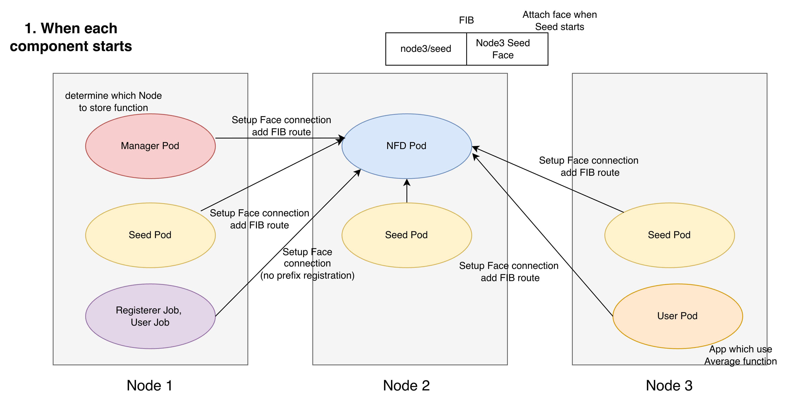
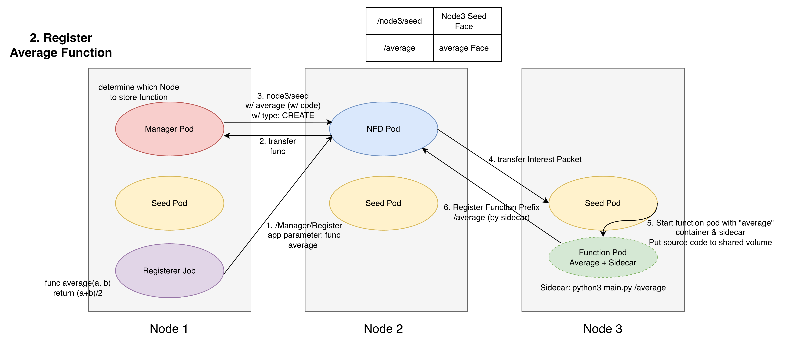
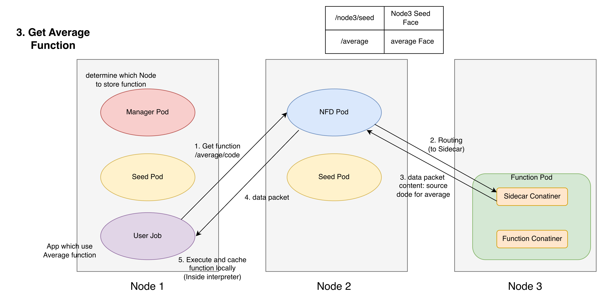
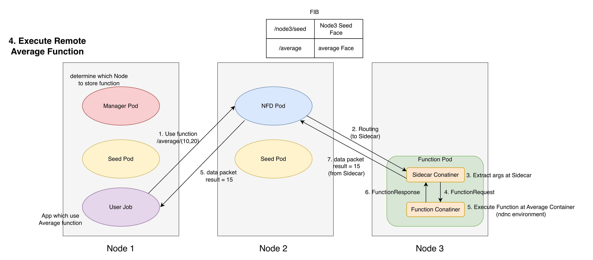

### 補足
- Invoker Jobは、ndnc runの実行のみ行い言語仕様の中でInterest Packetの送信を行なっている。関数やデータのキャッシュも行う。
    - キャッシュがあれば：コードをローカル実行
    - キャッシュがなければ：`/average/code` でコードを取得してローカル実行
    - コード取得に失敗したら：`/average/(10, 20)` で function Pod に実行を依頼
- ↑は、average関数を2回呼ぶコードを作り、function-averageのsidecarのログを見て関数コードを返却したログが1回しか出ていなければ2回目はndncのローカルで処理されたことを示す。
```bash
INFO:ndn_function_grpc:Function prefix registered: /average                                                                                           │
INFO:ndn_function_grpc:Received Interest: /average/code                                                                                               │
INFO:ndn_function_grpc:Code request: /average/code; serving source without executing the function                                                     │
INFO:ndn_function_grpc:Returned function code: name=/average/code bytes=38
```